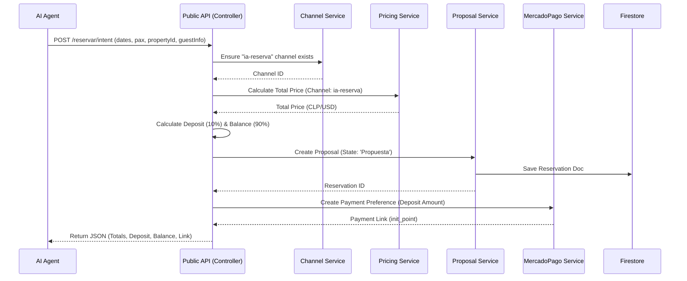

# Design Document: AI Booking Intent Endpoint (Phase 2)

## 1. Overview
This document outlines the design for the `POST /api/public/reservar/intent` endpoint. This endpoint allows AI agents to initiate a booking process, generating a formal proposal and a payment link for a 10% deposit, without requiring full upfront payment.

## 2. Data Flow



## 3. Detailed Logic

### 3.1. Channel Management
- **Logic**: The system must verify if a channel with `nombre: "ia-reserva"` exists for the tenant.
- **Action**:
    - If exists -> Use its ID.
    - If missing -> Create it automatically using `canalesService.crearCanal`.
    - **Configuration**: `comision: 0`, `tipo: 'Directo'`, `origen: 'ia'`.

### 3.2. Financial Model (10/90 Rule)
- **Goal**: Reduce friction for AI-driven bookings.
- **Calculation**:
    - `totalPrice`: Calculated using existing `calculoValoresService.calculatePrice`.
    - `depositAmount`: `Math.round(totalPrice * 0.10)`
    - `balanceDue`: `totalPrice - depositAmount`
- **Currency**: The payment link will be generated in the currency of the channel (likely CLP or USD depending on configuration).

### 3.3. Proposal Creation
- **Reuse**: We will reuse `gestionPropuestasService.guardarOActualizarPropuesta`.
- **Input**:
    - `fechaLlegada`, `fechaSalida`, `propiedadId`.
    - `guestInfo` (Name, Email, Phone) -> Will create/update client via `clientesService`.
    - `estado`: 'Propuesta' (Does not block calendar hard, but reserves the slot tentatively).
    - `origen`: 'ia-reserva'.

### 3.4. MercadoPago Integration
- **Requirement**: Install `mercadopago` SDK.
- **Service**: Create `backend/services/mercadopagoService.js`.
- **Preference Data**:
    - `items`: Single item "Reserva: [Property Name]".
    - `quantity`: 1.
    - `unit_price`: `depositAmount`.
    - `currency_id`: 'CLP' (or 'USD').
    - `external_reference`: `idReserva` (from Firestore).
    - `back_urls`: Configure success/failure redirects (to frontend).

## 4. API Specification

### 4.1. Request
`POST /api/public/reservar/intent`

```json
{
  "propiedadId": "string",
  "fechaLlegada": "YYYY-MM-DD",
  "fechaSalida": "YYYY-MM-DD",
  "personas": number,
  "huesped": {
    "nombre": "string",
    "email": "string",
    "telefono": "string" // Optional but recommended
  }
}
```

### 4.2. Response (Success)
```json
{
  "meta": { ... },
  "data": {
    "reserva_id": "string",
    "estado": "Propuesta",
    "desglose_financiero": {
      "moneda": "CLP",
      "total_estadia": 100000,
      "monto_a_pagar_ahora": 10000,
      "saldo_al_checkin": 90000,
      "porcentaje_seña": "10%"
    },
    "link_pago": "https://www.mercadopago.cl/checkout/v1/redirect?...",
    "instrucciones": "El link de pago expira en 24 horas. La reserva no está confirmada hasta el pago de la seña."
  }
}
```

### 4.3. Response (Error)
- **409 Conflict**: Dates not available.
- **400 Bad Request**: Invalid data or capacity exceeded.

## 5. Implementation Plan

1.  **Install Dependencies**: `npm install mercadopago`.
2.  **Create Service**: `backend/services/mercadopagoService.js`.
3.  **Update Controller**: Add `createBookingIntent` to `publicAiController.js`.
4.  **Implement Logic**:
    - Channel check/create.
    - Price calc.
    - Proposal creation.
    - MP Link generation.
5.  **Route**: Add `POST /reservar/intent` to `publicRoutes.js`.
